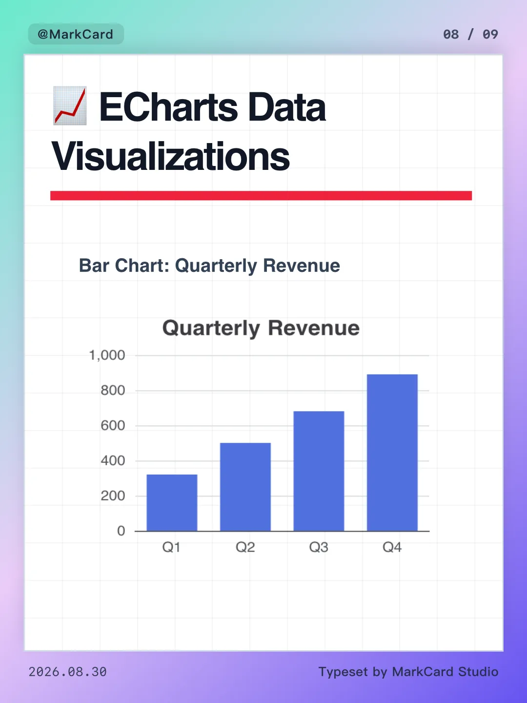
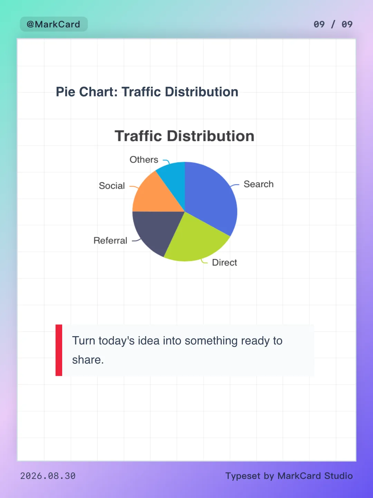

<div align="center">
  
  <h1>MarkCard Studio</h1>
  <p><strong>Turn Markdown into polished, publish-ready social media cards.</strong></p>
  <p>
    <a href="README.md">English</a> |
    <a href="README.zh-CN.md">简体中文</a> |
    <a href="https://markcard.woollypix.cn/">Official Website</a>
  </p>
  <p>
    
    
    
    
  </p>
</div>

MarkCard Studio is a local-first desktop authoring tool for content creators and knowledge sharers. Write in Markdown, let the studio paginate and typeset the content, choose a visual style and target canvas, then export a complete set of images or a PDF. Documents, local images, settings, and rendered output stay on your computer.

> MarkCard Studio is under active development. Interfaces and document behavior may change before a stable release.


## Highlights

- **Markdown-to-card workflow**: edit source and inspect the rendered cards side by side, with single-card and overview preview modes.
- **Automatic pagination**: split by `##`, by `##` and `###`, by a custom delimiter, by character count, or with adaptive smart pagination.
- **16 built-in themes**: styles range from Swiss Grid and Bauhaus to Apple Notes, newspaper, cyberpunk, Y2K, blueprint, and Riso-inspired layouts.
- **Publishing presets**: Xiaohongshu (3:4), Douyin (9:16), Weibo (6:7), square (1:1), and fully custom dimensions.
- **Rich Markdown rendering**: headings, lists, task lists, tables, blockquotes, callouts, images, highlighted code, KaTeX formulas, Mermaid diagrams, interactive ECharts charts, footnotes, emoji, and inline emphasis.
- **Flexible art direction**: solid colors, gradients, patterns, bundled wallpapers, custom background images, transparent output, and editable header/footer metadata.
- **Multi-format export**: export all pages as PNG or JPG, generate a multipage PDF, or combine the document into one long PNG. Output is grouped into a document-specific folder.
- **Local document support**: open and save Markdown files through native dialogs, resolve relative local images, persist settings, and recover unsaved drafts.
- **Responsive workspace**: docked panels on wide screens, drawers on compact screens, zoom controls, dark mode, undo/redo, and page reordering.
- **System-aware interface**: switch between English and Simplified Chinese, or follow the operating system language and appearance automatically.

## Result Gallery

The files in [`imgs/EN`](imgs/EN) are real card exports produced by MarkCard Studio.

**PDF demo:** [View the complete 7-page PDF export](imgs/EN/markcard-document-7pages.pdf)

<table>
  <tr>
    <td></td>
    <td></td>
    <td></td>
  </tr>
  <tr>
    <td></td>
    <td></td>
    <td></td>
  </tr>
  <tr>
    <td></td>
    <td></td>
    <td></td>
  </tr>
</table>

## Tech Stack

| Layer | Technology |
| --- | --- |
| Desktop shell | Tauri 2, Rust |
| Interface | Vue 3, JavaScript, Vite 6, vue-i18n |
| Styling | Tailwind CSS 4, DaisyUI, theme-specific CSS |
| Editor | CodeMirror 6 |
| Markdown | markdown-it and plugins |
| Rich content | Highlight.js, KaTeX, Mermaid, ECharts |
| Export | html-to-image, jsPDF |
| Icons | Lucide |

## Charts & Data Visualizations (ECharts)

MarkCard Studio natively supports interactive and static **ECharts** diagrams directly in Markdown via ````echarts` code blocks. Charts automatically adapt to card themes and dark mode, respect compact vertical spacing, and export sharply to high-resolution PNG, JPG, and PDF without rasterization clipping.

### 1. Basic Syntax

Write an `echarts` code block using either **JSON format** or **JavaScript Object format**:

#### Format A: Standard JSON
Strict JSON syntax with double-quoted keys. Great for structured data, API responses, and AI-generated content:

```markdown
```echarts
{
  "title": { "text": "Quarterly Revenue" },
  "xAxis": {
    "data": ["Q1", "Q2", "Q3", "Q4"]
  },
  "yAxis": { "type": "value" },
  "series": [{
    "type": "bar",
    "data": [320, 500, 680, 890]
  }]
}
```
```

#### Format B: JavaScript Object (Natural & Concise)
Standard JavaScript object syntax with unquoted keys, single quotes, trailing commas, and optional comments:

```markdown
```echarts
{
  title: { text: 'Quarterly Revenue' },
  xAxis: {
    data: ['Q1', 'Q2', 'Q3', 'Q4']
  },
  yAxis: { type: 'value' },
  series: [{
    type: 'bar',
    data: [320, 500, 680, 890]
  }]
}
```
```

### 2. Customizing Chart Height

MarkCard Studio automatically infers optimal chart heights based on chart complexity. If you want to explicitly specify a fixed pixel height, two main syntax formats are supported on the code fence:

1. **Direct number (Concise)**:
   ```markdown
   ```echarts 260
   { ... }
   ```
   ```
   *(Also accepts ````echarts 260px`)*

2. **Attribute assignment (`height=...` or `h=...`)**:
   ```markdown
   ```echarts height=260
   { ... }
   ```
   ```
   *(Also accepts ````echarts h=260` or ````echarts height:260`)*

> 💡 **Tip**: You can also specify height inside the code block via a leading comment (e.g. `// height: 260`) or directly as an Option property (`{ "height": 260, ... }`). Height values are safely bounded between 120px and 600px.

### 3. Supported Chart Types

- **Bar Charts (`bar`)**: Category comparisons, quarterly results, horizontal ranking bars.
- **Line Charts (`line`)**: Time series trends, smoothed metrics, area curves.
- **Pie & Donut Charts (`pie`)**: Channel distribution and composition breakdown with outer label clipping prevention and symmetric centering.
- **Radar, Heatmaps & More**: Supports all standard ECharts coordinate systems.

> 💡 **Quick Insertion**: Click the **📊 Insert Chart** button in the editor toolbar to open a dropdown menu and insert ready-to-use bar, line, or pie templates with built-in syntax tips.

## Getting Started

### Prerequisites

- Node.js 22.12.0 or newer (the release workflow uses 22.12.0)
- [pnpm](https://pnpm.io/)
- For the desktop app: a Rust toolchain and the [Tauri 2 system prerequisites](https://v2.tauri.app/start/prerequisites/) for your operating system

### Install

```bash
git clone https://github.com/pangxiaobin/MarkCardStudio.git
cd MarkCardStudio
pnpm install
```

### Run the desktop app

```bash
pnpm tauri dev
```

### Build

```bash
# Build native application bundles
pnpm tauri build
```

Native bundle types depend on the host operating system and installed Tauri prerequisites.

## How It Works

1. Open an existing Markdown document or start a new one.
2. Choose a pagination strategy and adjust the generated pages when needed.
3. Select a platform preset, theme, background, and card metadata.
4. Review the complete document in the preview canvas.
5. Pick PNG, JPG, PDF, or long PNG and select an output folder.
6. Export the entire set. MarkCard Studio creates an organized subfolder for the document.

## Project Structure

```text
src/
├── components/          Vue workspace, preview, and settings UI
├── composables/         Document state, parsing, pagination, and export
├── config/              Theme metadata and cover sticker mappings
└── styles/themes/       Shared card styles and individual themes
src-tauri/
├── src/files.rs         Native Markdown, image, folder, and export commands
└── tauri.conf.json      Desktop application and bundle configuration
public/
├── stickers/openmoji/   Bundled OpenMoji sticker assets
└── wallpapers/          Local background images
imgs/                    Workspace screenshot and exported result examples
```

Contributor and coding-agent guidance lives in [`AGENTS.md`](AGENTS.md).

## Contributing

Issues and pull requests are welcome. Keep changes focused, preserve preview/export visual parity, and run both the frontend build and Rust checks for changes that cross the desktop boundary. See [`AGENTS.md`](AGENTS.md) for the repository's architecture and validation checklist.

## Asset Attribution

The bundled OpenMoji stickers are provided by [OpenMoji](https://openmoji.org/) under [CC BY-SA 4.0](https://creativecommons.org/licenses/by-sa/4.0/). Their attribution is retained in [`public/stickers/openmoji/README.md`](public/stickers/openmoji/README.md). Third-party assets remain subject to their own licenses.

## License

MarkCard Studio is free software licensed under the [GNU General Public License v3.0](LICENSE). You may use, study, modify, and redistribute it under the terms of that license.

## Community

- Friendly community: [linux.do](https://linux.do)

## Star History

[](https://star-history.dera.page/#pangxiaobin/MarkCardStudio)
