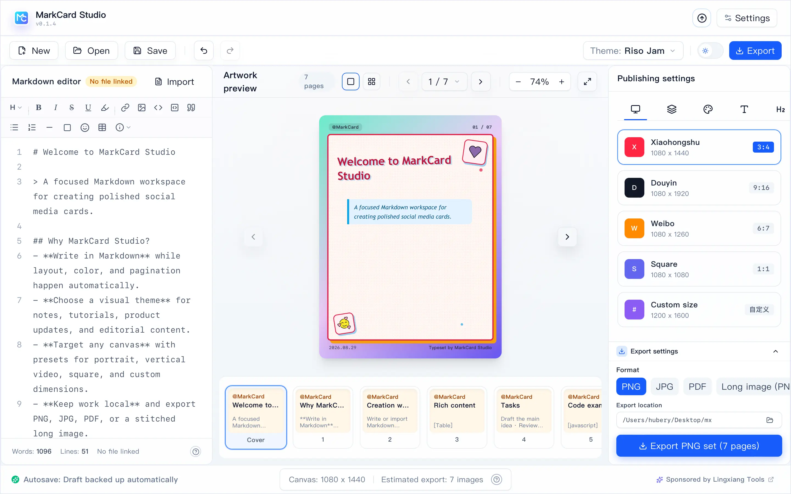
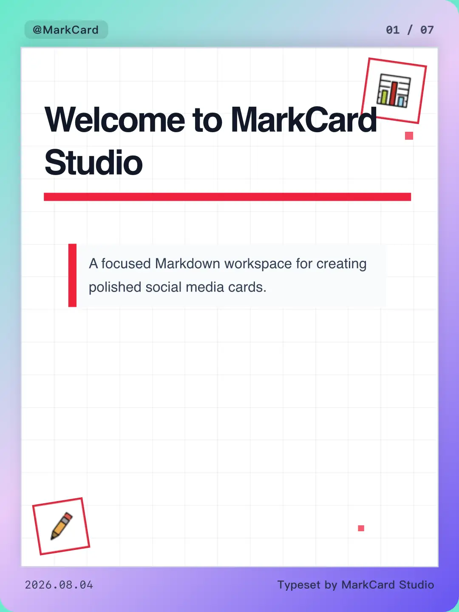
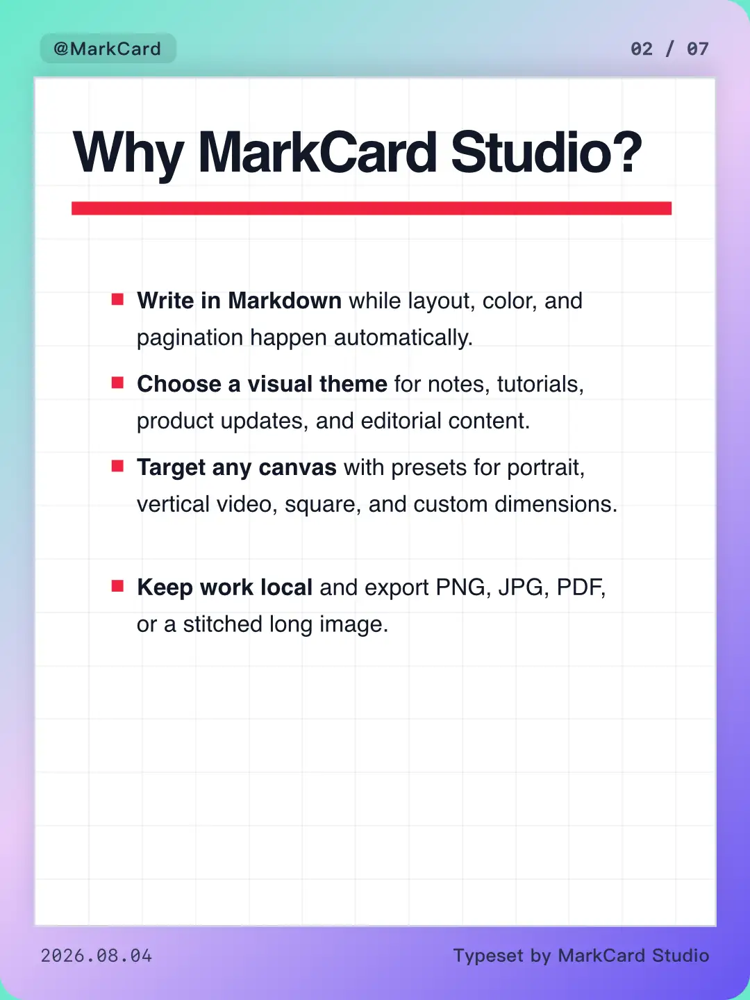
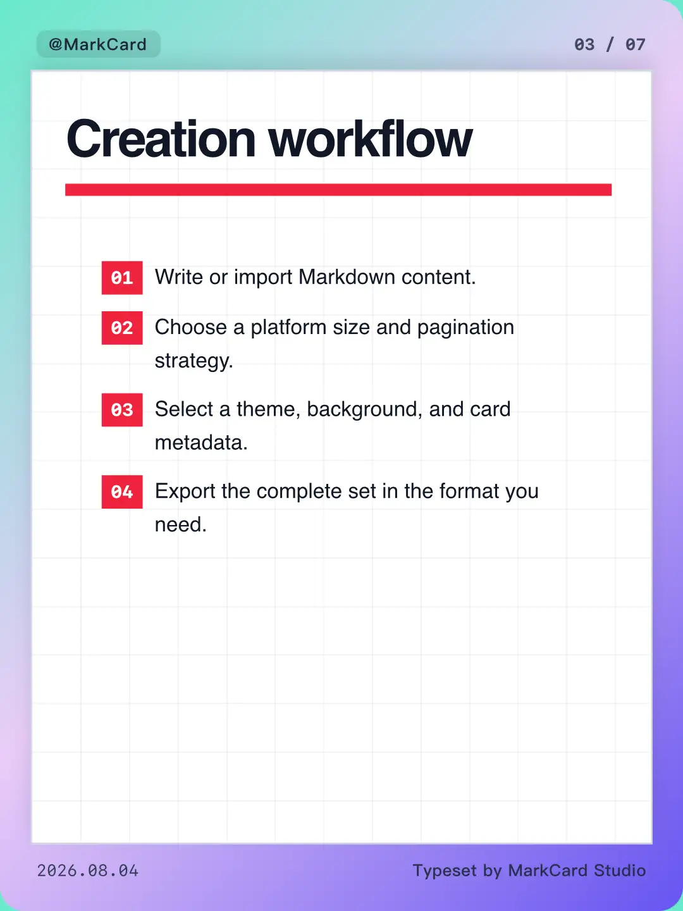
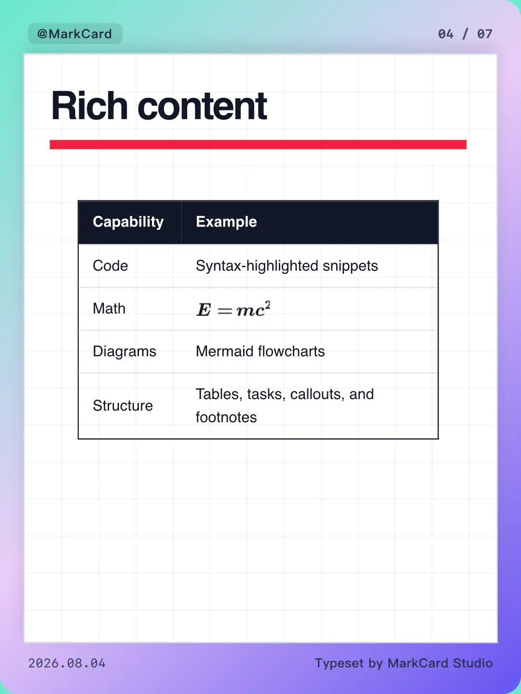
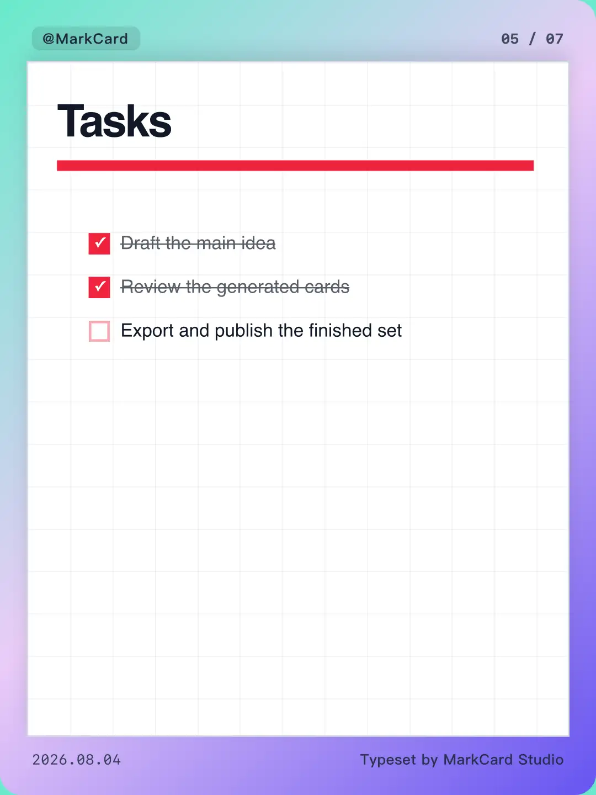
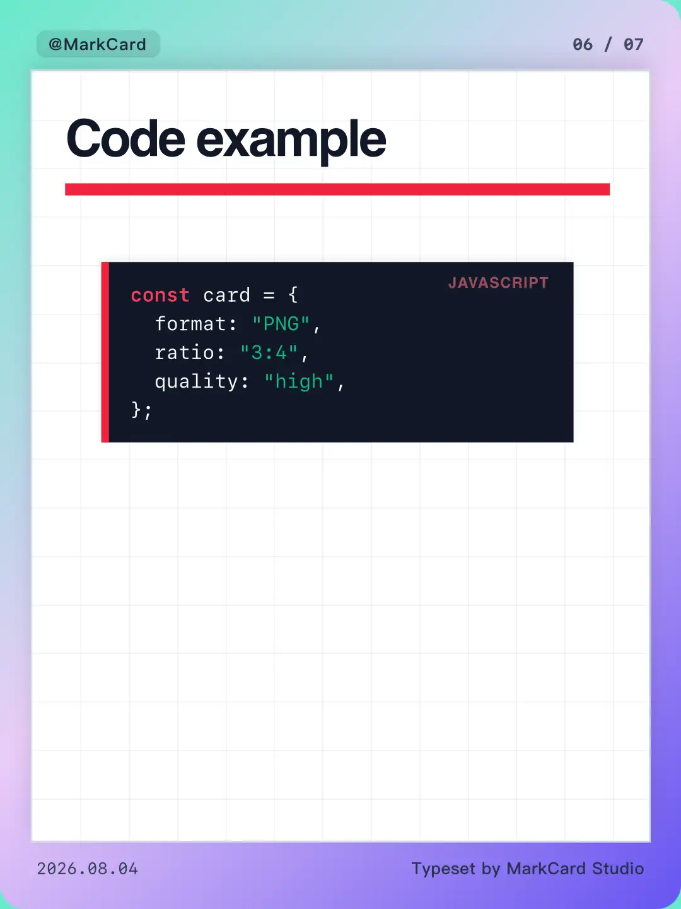
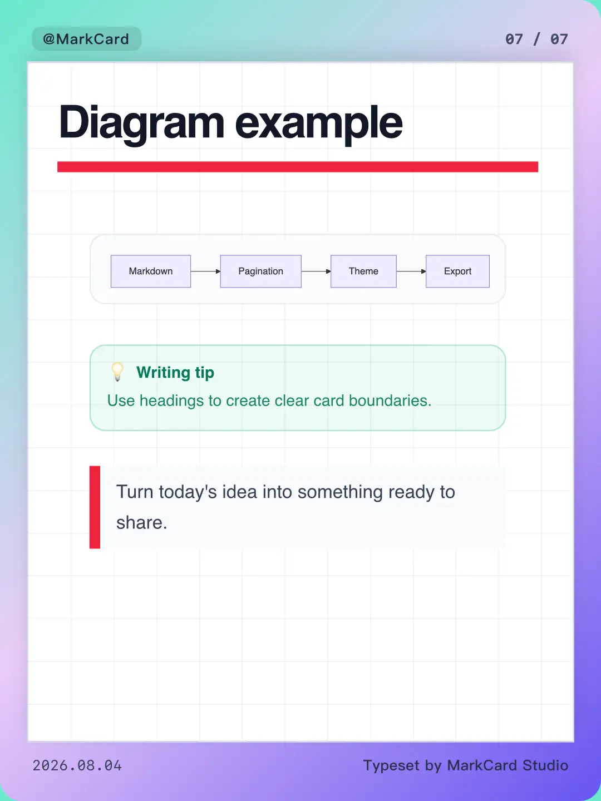

<div align="center">
  
  <h1>MarkCard Studio</h1>
  <p><strong>Turn Markdown into polished, publish-ready social media cards.</strong></p>
  <p>
    <a href="README.md">English</a> |
    <a href="README.zh-CN.md">简体中文</a>
  </p>
  <p>
    
    
    
    
  </p>
</div>

MarkCard Studio is a local-first desktop authoring tool for content creators and knowledge sharers. Write in Markdown, let the studio paginate and typeset the content, choose a visual style and target canvas, then export a complete set of images or a PDF. Documents, local images, settings, and rendered output stay on your computer.

> MarkCard Studio is under active development. Interfaces and document behavior may change before a stable release.



## Highlights

- **Markdown-to-card workflow**: edit source and inspect the rendered cards side by side, with single-card and overview preview modes.
- **Automatic pagination**: split by `##`, by `##` and `###`, by a custom delimiter, by character count, or with adaptive smart pagination.
- **16 built-in themes**: styles range from Swiss Grid and Bauhaus to Apple Notes, newspaper, cyberpunk, Y2K, blueprint, and Riso-inspired layouts.
- **Publishing presets**: Xiaohongshu (3:4), Douyin (9:16), Weibo (6:7), square (1:1), and fully custom dimensions.
- **Rich Markdown rendering**: headings, lists, task lists, tables, blockquotes, callouts, images, highlighted code, KaTeX formulas, Mermaid diagrams, footnotes, emoji, and inline emphasis.
- **Flexible art direction**: solid colors, gradients, patterns, bundled wallpapers, custom background images, transparent output, and editable header/footer metadata.
- **Multi-format export**: export all pages as PNG or JPG, generate a multipage PDF, or combine the document into one long PNG. Output is grouped into a document-specific folder.
- **Local document support**: open and save Markdown files through native dialogs, resolve relative local images, persist settings, and recover unsaved drafts.
- **Responsive workspace**: docked panels on wide screens, drawers on compact screens, zoom controls, dark mode, undo/redo, and page reordering.
- **System-aware interface**: switch between English and Simplified Chinese, or follow the operating system language and appearance automatically.

## Result Gallery

The files in [`imgs/EN`](imgs/EN) are real card exports produced by MarkCard Studio.

**PDF demo:** [View the complete 7-page PDF export](imgs/EN/markcard-document-7pages.pdf)

<table>
  <tr>
    <td></td>
    <td></td>
    <td></td>
  </tr>
  <tr>
    <td></td>
    <td></td>
    <td></td>
  </tr>
  <tr>
    <td></td>
    <td></td>
    <td></td>
  </tr>
</table>

## Tech Stack

| Layer | Technology |
| --- | --- |
| Desktop shell | Tauri 2, Rust |
| Interface | Vue 3, JavaScript, Vite 6, vue-i18n |
| Styling | Tailwind CSS 4, DaisyUI, theme-specific CSS |
| Editor | CodeMirror 6 |
| Markdown | markdown-it and plugins |
| Rich content | Highlight.js, KaTeX, Mermaid |
| Export | html-to-image, jsPDF |
| Icons | Lucide |

## Getting Started

### Prerequisites

- Node.js 18 or newer
- [pnpm](https://pnpm.io/)
- For the desktop app: a Rust toolchain and the [Tauri 2 system prerequisites](https://v2.tauri.app/start/prerequisites/) for your operating system

### Install

```bash
git clone <your-fork-or-repository-url>
cd MarkCardStudio
pnpm install
```

### Run in a browser

```bash
pnpm dev
```

The browser build is useful for interface work. Native file dialogs and direct filesystem output require the Tauri app; browser mode uses the available web fallbacks.

### Run the desktop app

```bash
pnpm tauri dev
```

### Build

```bash
# Build the web assets
pnpm build

# Build native application bundles
pnpm tauri build
```

Native bundle types depend on the host operating system and installed Tauri prerequisites.

## How It Works

1. Open an existing Markdown document or start a new one.
2. Choose a pagination strategy and adjust the generated pages when needed.
3. Select a platform preset, theme, background, and card metadata.
4. Review the complete document in the preview canvas.
5. Pick PNG, JPG, PDF, or long PNG and select an output folder.
6. Export the entire set. MarkCard Studio creates an organized subfolder for the document.

## Project Structure

```text
src/
├── components/          Vue workspace, preview, and settings UI
├── composables/         Document state, parsing, pagination, and export
├── config/              Theme metadata and cover sticker mappings
└── styles/themes/       Shared card styles and individual themes
src-tauri/
├── src/files.rs         Native Markdown, image, folder, and export commands
└── tauri.conf.json      Desktop application and bundle configuration
public/
├── stickers/openmoji/   Bundled OpenMoji sticker assets
└── wallpapers/          Local background images
imgs/                    Workspace screenshot and exported result examples
```

Contributor and coding-agent guidance lives in [`AGENTS.md`](AGENTS.md).

## Contributing

Issues and pull requests are welcome. Keep changes focused, preserve preview/export visual parity, and run both the frontend build and Rust checks for changes that cross the desktop boundary. See [`AGENTS.md`](AGENTS.md) for the repository's architecture and validation checklist.

## Asset Attribution

The bundled OpenMoji stickers are provided by [OpenMoji](https://openmoji.org/) under [CC BY-SA 4.0](https://creativecommons.org/licenses/by-sa/4.0/). Their attribution is retained in [`public/stickers/openmoji/README.md`](public/stickers/openmoji/README.md). Third-party assets remain subject to their own licenses.

## License

MarkCard Studio is free software licensed under the [GNU General Public License v3.0](LICENSE). You may use, study, modify, and redistribute it under the terms of that license.
