<div align="center">
  
  <h1>MarkCard Studio</h1>
  <p><strong>把 Markdown 变成精美、可直接发布的社交媒体卡片。</strong></p>
  <p>
    <a href="README.md">English</a> |
    <a href="README.zh-CN.md">简体中文</a>
  </p>
  <p>
    
    
    
    
  </p>
</div>

MarkCard Studio 是一款面向内容创作者和知识分享者的本地优先桌面创作工具。使用 Markdown 写作，由工作台自动分页、排版，再选择视觉主题和目标画布，一次导出整套图片或 PDF。文档、本地图片、设置和渲染结果均保留在你的电脑上。

> MarkCard Studio 仍在积极开发中，稳定版本发布前，界面和文档行为可能发生变化。


## 功能亮点

- **Markdown 卡片工作流**：左侧编辑源码，中间实时查看卡片，支持单页与总览两种预览模式。
- **自动分页**：可按 `##`、按 `##` 与 `###`、自定义分隔符、字符数或智能自适应策略切页。
- **16 套内置主题**：涵盖瑞士网格、包豪斯、苹果备忘录、复古报刊、暗黑极客、Y2K、蓝图、Riso 等风格。
- **发布平台预设**：小红书 3:4、抖音 9:16、微博 6:7、通用方形 1:1，以及完全自定义尺寸。
- **丰富的 Markdown 渲染**：支持标题、列表、任务列表、表格、引用、提示块、图片、代码高亮、KaTeX 公式、Mermaid 图表、脚注、Emoji 和行内样式。
- **灵活的视觉设置**：可选择纯色、渐变、图案、内置壁纸、自定义背景图片、透明背景，并编辑页眉页脚信息。
- **多格式导出**：整套导出 PNG 或 JPG，生成多页 PDF，或把全部页面拼接成长 PNG；输出会按文档自动整理到独立目录。
- **本地文档能力**：通过系统对话框打开和保存 Markdown，解析相对路径本地图片，持久化用户设置，并恢复未保存草稿。
- **响应式工作台**：宽屏停靠、窄屏抽屉、缩放、深色模式、撤销重做和页面排序一应俱全。
- **跟随系统的界面**：支持 English 与简体中文，也可自动跟随操作系统语言和明暗外观。

## 结果案例

[`imgs/ZH`](imgs/ZH) 目录中的图片均为 MarkCard Studio 的实际导出结果。

**PDF 示例：**[查看完整的 11 页 PDF 导出效果](imgs/ZH/markcard-document-11pages.pdf)

<table>
  <tr>
    <td>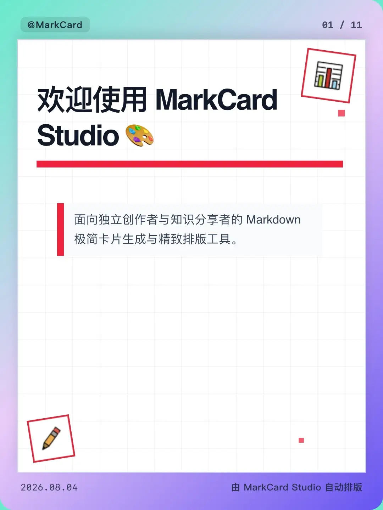</td>
    <td>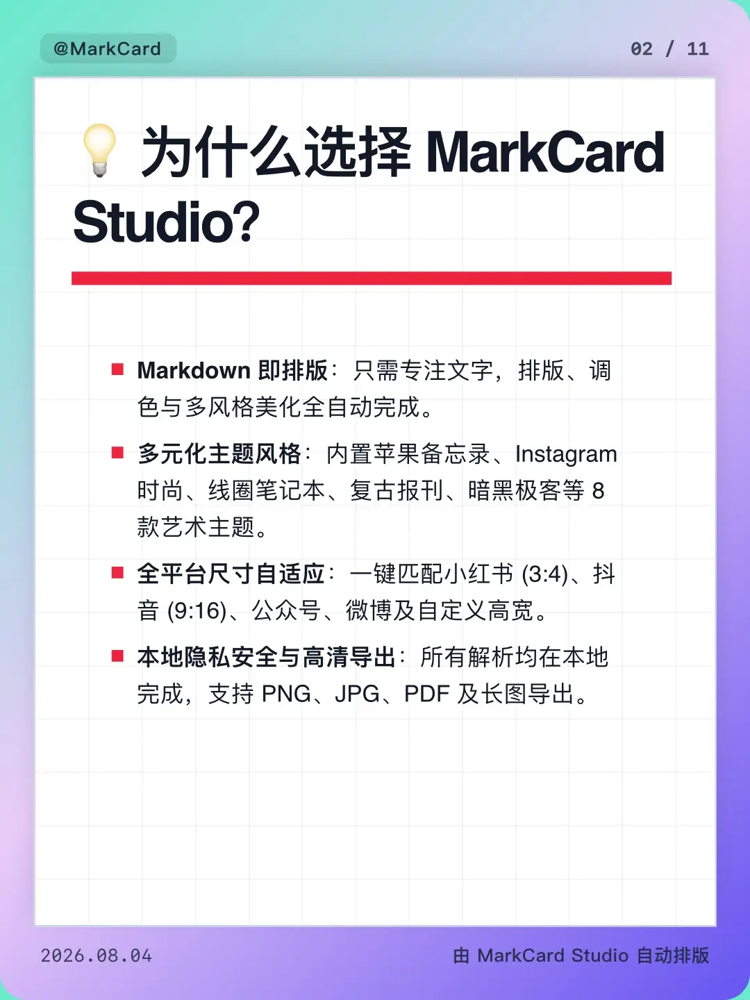</td>
    <td>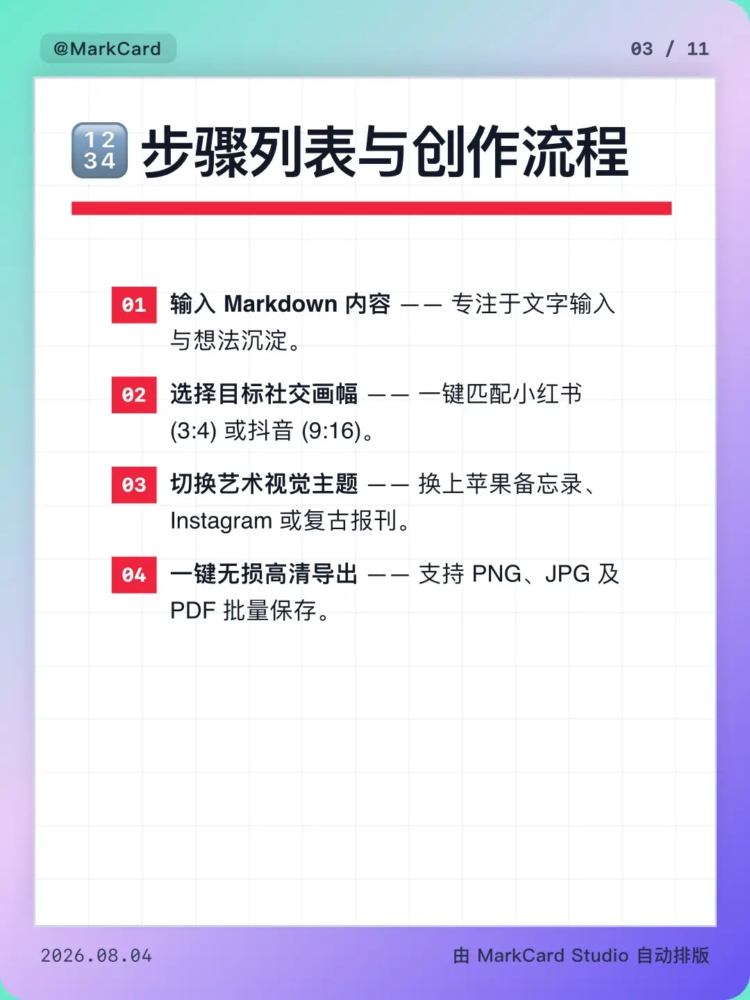</td>
  </tr>
  <tr>
    <td>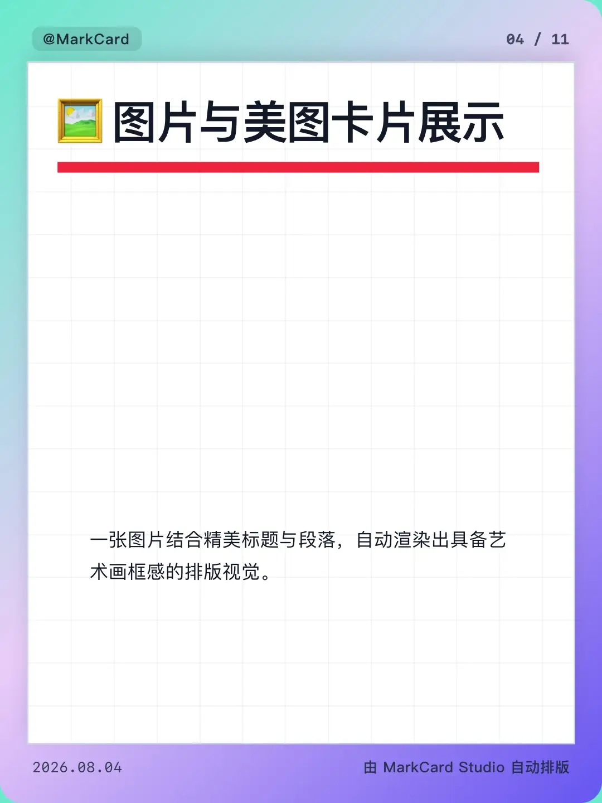</td>
    <td>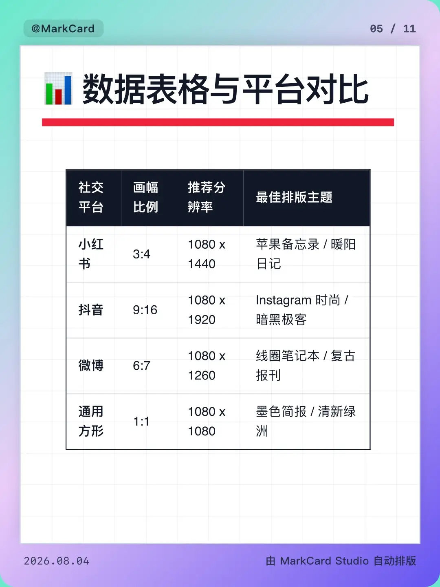</td>
    <td>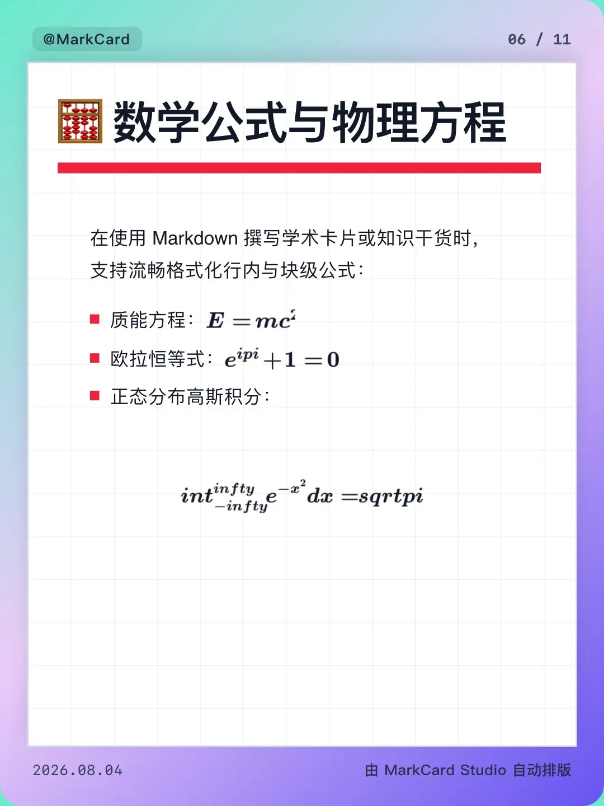</td>
  </tr>
  <tr>
    <td>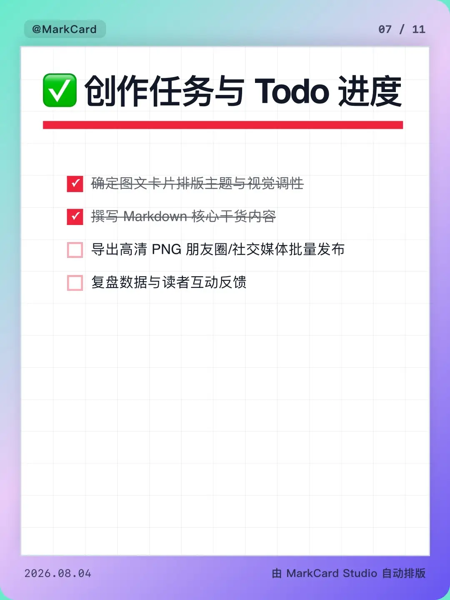</td>
    <td>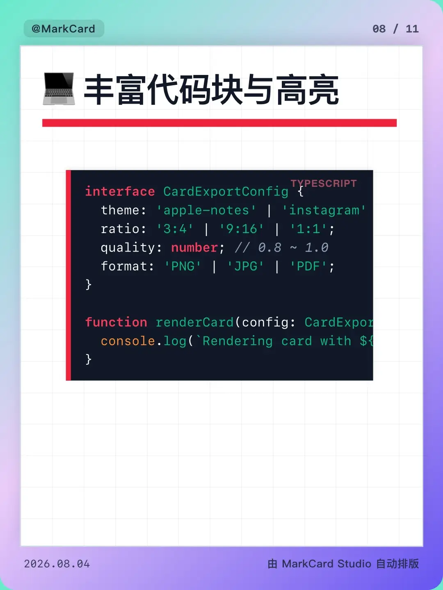</td>
    <td>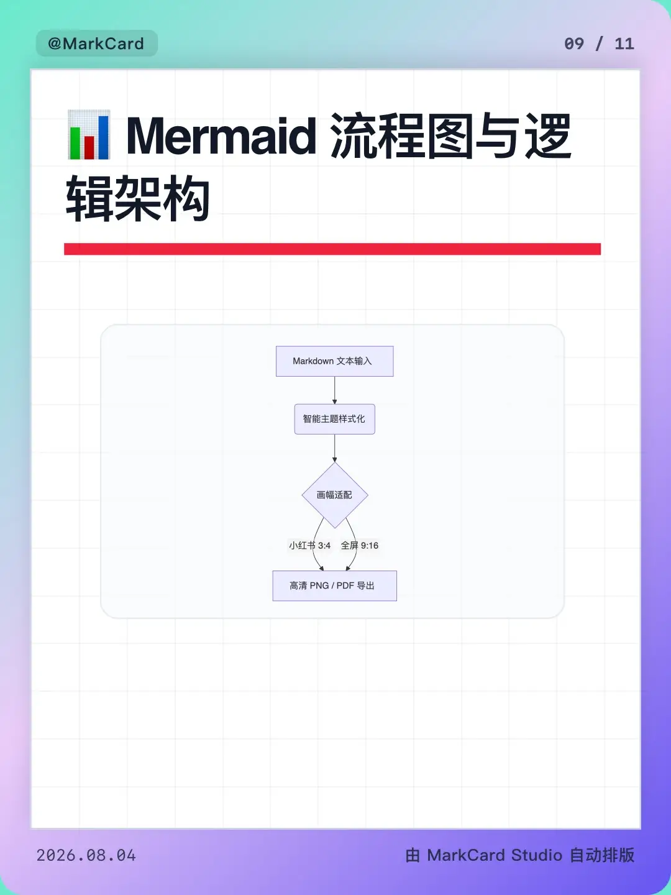</td>
  </tr>
  <tr>
    <td>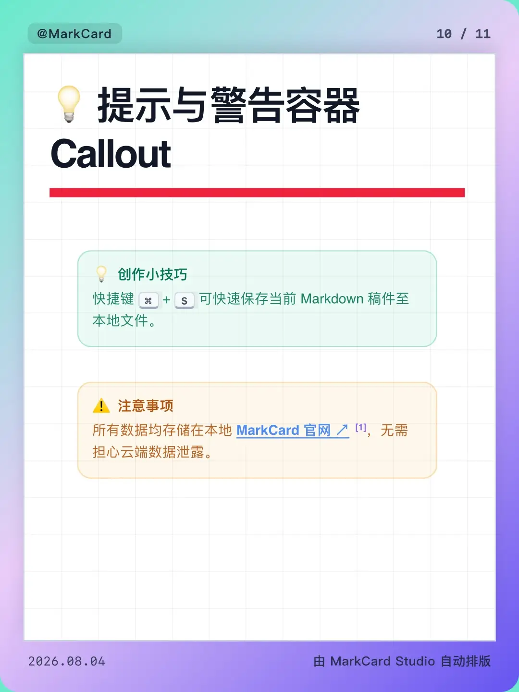</td>
    <td>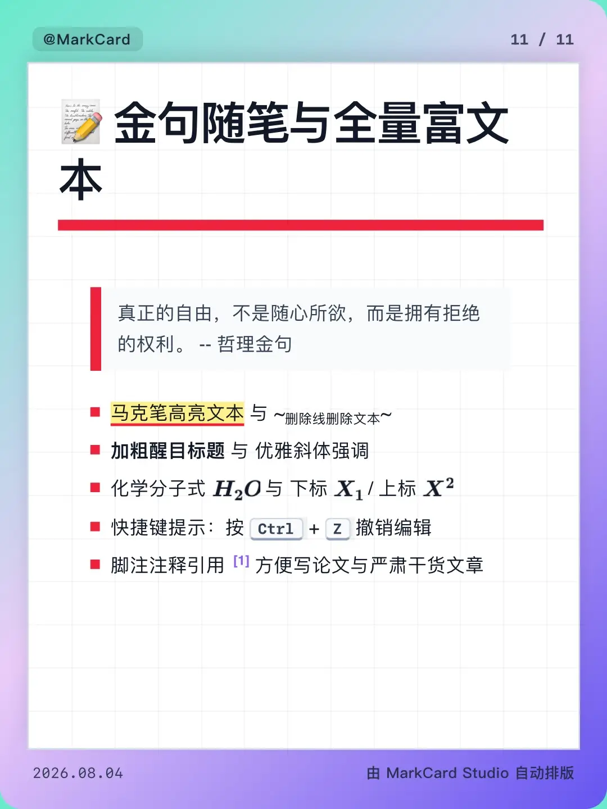</td>
    <td></td>
  </tr>
</table>

## 技术栈

| 层级 | 技术 |
| --- | --- |
| 桌面端 | Tauri 2、Rust |
| 界面 | Vue 3、JavaScript、Vite 6、vue-i18n |
| 样式 | Tailwind CSS 4、DaisyUI、主题 CSS |
| 编辑器 | CodeMirror 6 |
| Markdown | markdown-it 及其插件 |
| 富内容 | Highlight.js、KaTeX、Mermaid |
| 导出 | html-to-image、jsPDF |
| 图标 | Lucide |

## 快速开始

### 环境要求

- Node.js 18 或更高版本
- [pnpm](https://pnpm.io/)
- 运行桌面端还需要 Rust 工具链，以及当前操作系统对应的 [Tauri 2 系统依赖](https://v2.tauri.app/start/prerequisites/)

### 安装

```bash
git clone <你的仓库或派生仓库地址>
cd MarkCardStudio
pnpm install
```

### 在浏览器中运行

```bash
pnpm dev
```

浏览器模式适合开发界面。原生文件对话框和直接写入文件系统需要 Tauri 桌面端；浏览器模式会使用可用的 Web 降级方案。

### 运行桌面应用

```bash
pnpm tauri dev
```

### 构建

```bash
# 构建前端资源
pnpm build

# 构建原生应用安装包
pnpm tauri build
```

可生成的安装包类型取决于当前操作系统和已安装的 Tauri 系统依赖。

## 使用流程

1. 打开已有 Markdown 文档，或新建一篇内容。
2. 选择分页策略，并按需要调整生成的页面。
3. 选择平台尺寸、主题、背景和卡片署名信息。
4. 在预览画布中检查完整作品。
5. 选择 PNG、JPG、PDF 或长图 PNG，并指定输出目录。
6. 导出整套作品，MarkCard Studio 会为当前文档创建独立目录。

## 项目结构

```text
src/
├── components/          工作台、预览与设置相关 Vue 组件
├── composables/         文档状态、解析、分页与导出逻辑
├── config/              主题元数据和封面贴纸映射
└── styles/themes/       卡片公共样式与各套主题样式
src-tauri/
├── src/files.rs         Markdown、图片、目录和导出的原生命令
└── tauri.conf.json      桌面应用与打包配置
public/
├── stickers/openmoji/   内置 OpenMoji 贴纸资源
└── wallpapers/          本地背景图片
imgs/                    工作台截图和导出结果案例
```

贡献者和代码代理的开发说明见 [`AGENTS.md`](AGENTS.md)。

## 参与贡献

欢迎提交 Issue 和 Pull Request。请保持改动聚焦，确保预览与导出效果一致；若改动跨越桌面端边界，应同时运行前端构建和 Rust 检查。仓库架构及验证清单详见 [`AGENTS.md`](AGENTS.md)。

## 素材署名

内置 OpenMoji 贴纸来自 [OpenMoji](https://openmoji.org/)，采用 [CC BY-SA 4.0](https://creativecommons.org/licenses/by-sa/4.0/) 许可，署名信息保留在 [`public/stickers/openmoji/README.md`](public/stickers/openmoji/README.md) 中。第三方素材仍受其各自许可证约束。

## 开源许可

MarkCard Studio 是采用 [GNU General Public License v3.0](LICENSE) 的自由软件。你可以按照该许可证的条款使用、研究、修改和再分发本项目。
